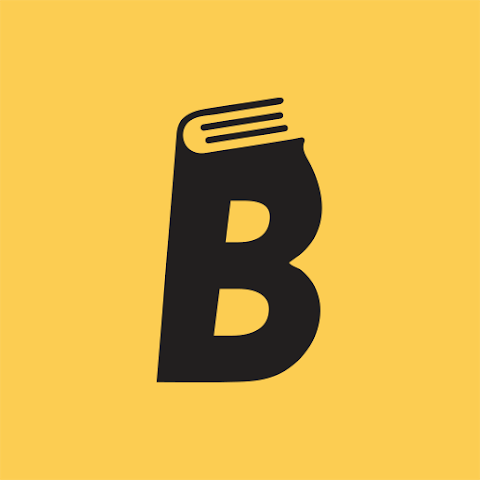
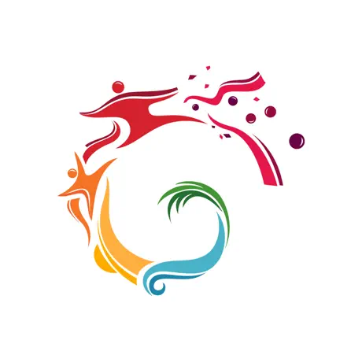
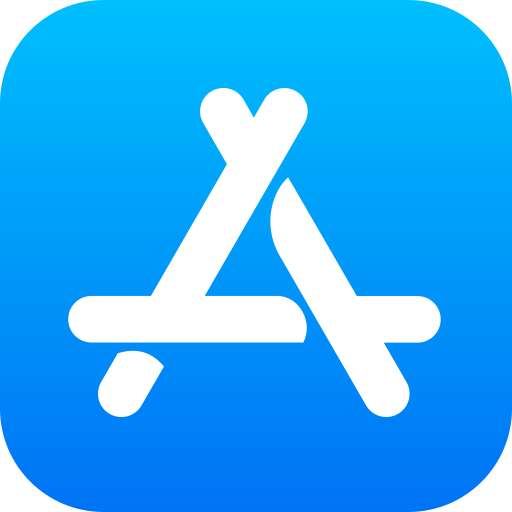

---

<!-- TOC -->
  * [🏠 About](#-about)
  * [⚒️ Frameworks and Technologies](#-frameworks-and-technologies)
    * [👨‍💻 Programming Languages](#-programming-languages)
    * [🧰 Frameworks](#-frameworks)
  * [🔓 Top Open Source Projects](#-top-open-source-projects)
  * [🏗 Projects Portfolio](#-projects-portfolio)
  * [📝 Latest Articles](#-latest-articles)
  * [📞 Contact me](#-contact-me)
  * [⚡️ Stats](#-stats)
<!-- TOC -->

## 🏠 About

I’m a Mobile Developer located in Egypt. I have a serious passion for programming, AI, and creating
mobile apps with intuitive, dynamic user experiences. Well-organized person, problem solver, and
independent employee with high attention to detail. Fan of Al Ahly SC, Football, TV series, and
Movies. Interested in the entire Mobile Development Stack and working on ambitious projects with
positive people.

- 👨🏼‍💻 I work currently as a Flutter & iOS Developer at [WalaPlus💚](http://www.walaplus.com/).
- 📖 I’m currently learning everything about Flutter and iOS development.
- 🌍 Check out my portfolio [here](https://mohanedy98.github.io).

## ⚒️ Frameworks and Technologies

### 👨‍💻 Programming Languages

  
  
  
  
  
  

### 🧰 Frameworks

## 🔓 Open Source Projects

  <table>
    <thead align="center">
      <tr>
        <td><b>💻 Project</b></td>
        <td><b>🌟 Stars</b></td>
        <td><b>🍴 Forks</b></td>
        <td><b>🐛 Issues</b></td>
        <td><b>🔔 Pull Requests</b></td>
        <td><b>👨‍💻 Language</b></td>
      </tr>
    </thead>
    <tbody>
      <tr>
	      <td><a href="https://github.com/Mohanedy98/swifty-marvel"><b>SwiftyMarvel 🦸‍♂️</b></a></td>
        <td></td>
        <td></td>
        <td></td>
        <td></td>
        <td></td>
      </tr>
      <tr>
	      <td><a href="https://github.com/mohanedy98/nile-gift"><b>Nile Gift 📜</b></a></td>
        <td></td>
        <td></td>
        <td></td>
        <td></td>
        <td></td>
      </tr>
      <tr>
	      <td><a href="https://github.com/abdelhamid-f-nasser/sliver-snap"><b>Sliver Snap ↕️</b></a></td>
        <td></td>
        <td></td>
        <td></td>
        <td></td>
        <td></td> 
      </tr>
    </tbody>
  </table>

## 🏗 Projects Portfolio

| Project                                                                                                                                                                                                                                                                                                                                     | Links                                                                                                                                                                                                                                                                                                                                                  |
|---------------------------------------------------------------------------------------------------------------------------------------------------------------------------------------------------------------------------------------------------------------------------------------------------------------------------------------------|--------------------------------------------------------------------------------------------------------------------------------------------------------------------------------------------------------------------------------------------------------------------------------------------------------------------------------------------------------|
|  **iRead** Subscription based ebook reader.                                                                                                                                                                                                                             | Not published yet                                                                                                                                                                                                                                                                                                                                      |
|  **Community Festival**  is an application that enables, facilitates, and enhances the community experience in a safe, secure, fast way by helping the owners and tenants for CFC units to request any service, send complaints, invite guests and send them invitations. | 
  
                                                                                                                                                                                        |
|  **Jam3ty** Subscription based courses streaming app.                                                                                                                                                                                                                  | 
  
 |
|  **Traglob**  App that takes care of everything from marketing and payments to secure transactions and shipping.                                                                                                                                                      | 
  
                                                       |
|  **ThawanyTAG**  App that share social accounts using NFC.                                                                                                                                                                                                               | 
  
                                                    |
|  **Dpro Pharmacy Archiving**  App that archive and save pharmacists' data and bills.                                                                                                                                                                                            | 
   
                                         |

## 📝 Latest Articles

## 📞 Contact me

 
   

## ⚡️ Stats

---

  

  
