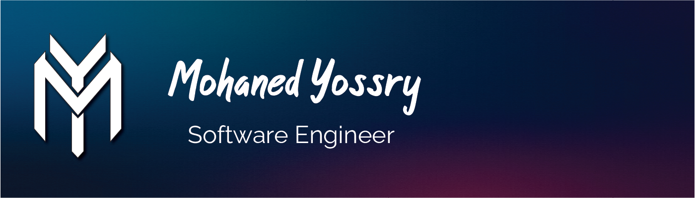

## ℹ️ About
I’m a Mobile Developer located in Egypt. I have a serious passion for programming, AI, and creating mobile apps with intuitive, dynamic user experiences. Well-organized person, problem solver, independent employee with high attention to detail. Fan of Al Ahly SC, Football, TV series, and Movies. Interested in the entire Mobile Development Stack and working on ambitious projects with positive people.

- 👨🏼‍💻 I work currently as a Flutter & iOS Developer at Devstric.
- 📖 I’m currently learning ML with python.
- 🌍 Check out my latest projects [here](https://mohanedy98.github.io).

## 📝 Articles

## 📞 Contact Me
                  

## ⚡️ Stats

 
 

---

  
  

  
<!--
**Mohanedy98/Mohanedy98** is a ✨ _special_ ✨ repository because its `README.md` (this file) appears on your GitHub profile.

Here are some ideas to get you started:

- 🔭 I’m currently working on ...
- 🌱 I’m currently learning ...
- 👯 I’m looking to collaborate on ...
- 🤔 I’m looking for help with ...
- 💬 Ask me about ...
- 📫 How to reach me: ...
- 😄 Pronouns: ...
- ⚡ Fun fact: ...
-->
